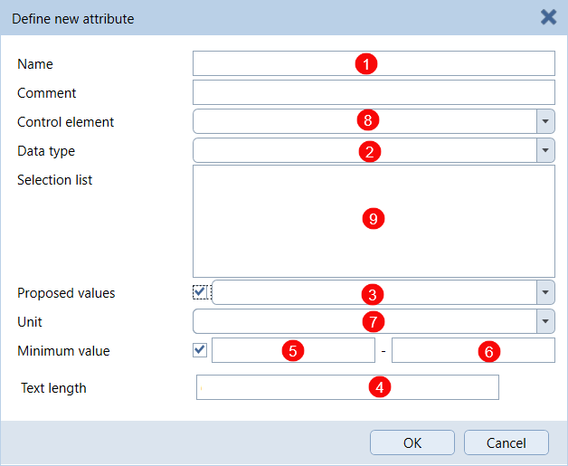
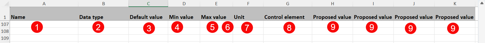
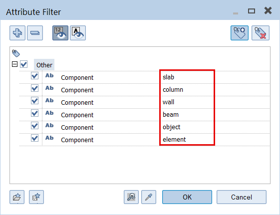
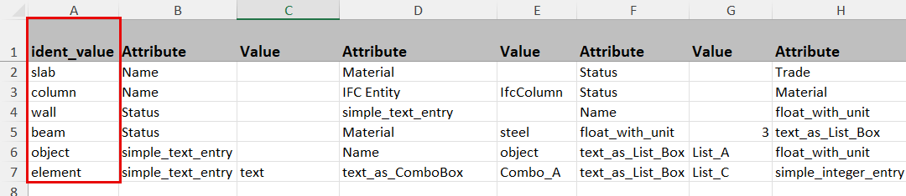
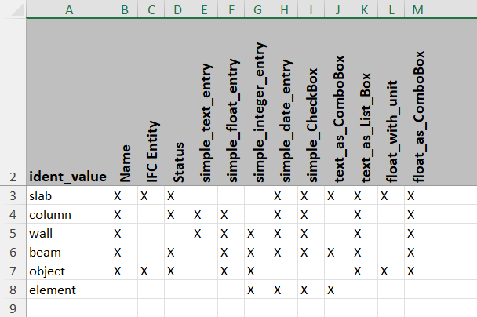
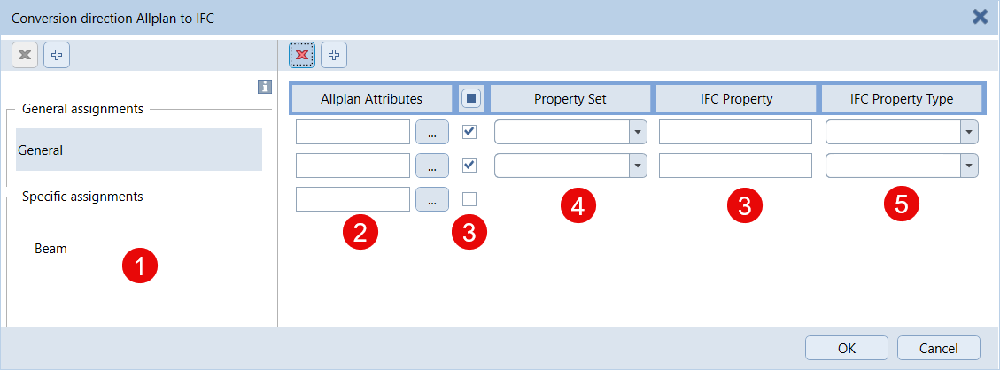
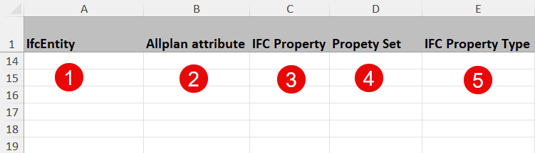

# PythonPart AttributeWorkflow

With this PythonPart it is possible to fullfill the complete workflow related to attribute and information managemenet. It mainly contains **3 individual steps** that can be executed more or less automatically:
- **define** attributes
- **assign** attributes to dedicated objects
- **create** a **mapping table** for the IFC export

An **Excel file** with a predefined schema serves as bais for each of them that is also delivered and installed as essential component of the PythonPart.

## Installation

The PythonPart **AttributeWorkflow** can be installed directly from the PluginManager in ALLPLAN. 

Alternatively, the corresponding ***.allep** package can be downloaded from the [release page](https://github.com/AnkeNiedermaier/attribute-workflow-public/releases). ***.allep** files are ALLPLAN internal setups that can be installed via drag and drop into the program window.

At least the version 2026 is needed to install the PythonPart.

## Installed PythonPart Scripts

If the installation was successfull, the PythonPart **AttributeWorkfolw.pyp** can be found
in the ALLPLAN Library:
`Office` → `Library` → `ALLPLAN GmbH` → `AttributeWorkflow`

Besides the library, the PythonPart can also be found in the ActionBar in a newly created task area **AttributeTools** inside the task **Plug-ins**.

## Excel template

As the complete workflow covered with this PythonPart is based on Excel, a predefined file **Schema_AttributeWorkflow.xlsx** is also installed with the PythonPart. It is initially stored at the same place in the library (`Office` → `Library` → `ALLPLAN GmbH`) but can be moved afterward to any folder

> ⚠️IMPORTANT\
The schema and structure of the Ecxel file is fixed and predefined and should not be changed, otherwise the PythonPart will not run correctly! It is also recommended to work with a copy of the file and keep the original unchanged

## Preparation

All the definitions, parameters and information that are handed over to ALLPLAN in using the PythonPart have to be entered into the Excel file. Similar to the  worklflow steps, it contains the sheet
- Defintion
- Assignment
- Matrix
- Mapping

with all relevant rows, columns and cells

### Definition

to enter the parameters for the **creation of attributes** with a syntax similar to the one in ALLPLAN. Selection list values for the PullDown of ComboBox and ListBox attributes are entered in the column H and following

&nbsp;&nbsp;&nbsp;&nbsp;&nbsp;&nbsp;&nbsp;&nbsp;   

> ⚠️IMPORTANT\
In the current state of the PythonPart the Control element formula is not yet supported

### Assignment

serves to define combinations of a **filter/select statement** together with **pairs of attributes** that are assigned to all objects that fulfill the select criteria. Similar to the ALLPLAN functionality **Filter by Attribute** it is a combination of an attribute and its value. Thereby the relevant attribute is defined when running the PythonPart, whereas its required value is entered in the **ident_value** column. Each pair of attributes that should be assigned to the filtered objects consists of the **attribute name** and if applicable a **value** and are entered in the columns named accordingly. If no value is entered only the attribute itself is assigned and its value stays empty

&nbsp;&nbsp;&nbsp;&nbsp;&nbsp;&nbsp;&nbsp;&nbsp;   

### Matrix

can be used in addition or as an alternative if only attribute assignement without values is needed. The **filter/select statemen** is also defined in the **ident_value** column here, whereas the attributes to be assigned are selected in entering an **X** in the column with the corresponding **attribute name**

Which of the sheets **Assignment** or **Matrix** should be taken into account is decided during the execution of the PythonPart

### Mapping

is used to define a **mapping table (*.cfg)** that can be used during the IFC export to control the attribute transfer. The structure in the sheet is almost identical to the one in the ALLPLAN dialog

&nbsp;&nbsp;&nbsp;&nbsp;&nbsp;&nbsp;&nbsp;&nbsp;   

Only the **IFC Property column** has a special syntax as it can be used in different ways:
- left empty if the IFC property name should be the same as in ALLPLAN
- enter a name for the IFC property if different from the one in ALLPLAN
- enter an **X** to prevent the attribute transfer to IFC

> ⚠️IMPORTANT\
It is generaly recommended to use no "special characters" like "ä" or "!" as this can lead to problems and slow down the mapping file creation

## Workflow

Once installed, all ALLPLAN PythonParts can be found in the **Library palette**, no matter if an additional ActionBar entry is created or not. They are generally started either with a **double-click** on the icon or per **Drag and Drop** into the viewport. This shows the corresponding Properties palette and executes the underlying skripts

As the workflow as such and the Excel schema table, also the palette is structured in the 3 steps
- Definition
- Assignment
- Mapping

each represented in an individual section. The general upper part is relevant for all steps and serves to **select and open** the **Excel table** and **sheet** and the **path and name** to **save** the **mapping table**. Independend of the intended function the first step is always the Excel file selection, otherwise none of them can be executed.
For the attribute assignment also the relevant **identifier** attribute that holds the **ident_value** has to be determined. This is done in selecting it from the attribute dialog that is shown in clicking the corresponding button

All steps of the workflow can be executed independent and mainly the assignment repetead sequential with different specifications and identifiers

## Video

<a href="https://raw.githubusercontent.com/AnkeNiedermaier/attribute-workflow-public/main/docs/PP_AttributeWorkflow.mp4" target="_blank">
  
</a>